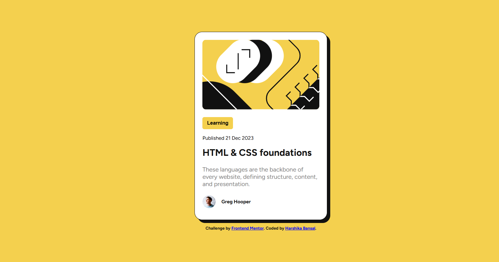
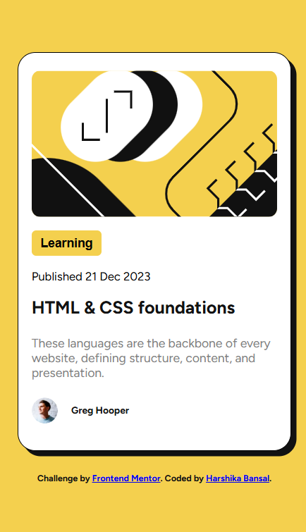

# Frontend Mentor - Blog Preview Card Solution



## ✨ Overview

This is my solution to the [Blog preview card challenge on Frontend Mentor](https://www.frontendmentor.io/challenges/blog-preview-card-ckPaj01dZH). The challenge was to build a blog preview card component that closely matches the provided design using only HTML and CSS.

---

## 🔗 Live Site

👉 [View Live Site](https://your-deployment-url-here.com)  
👉 [View on Frontend Mentor](https://www.frontendmentor.io/solutions/your-solution-url-here)

---

## 💻 Technologies Used

- HTML5
- CSS3
- Google Fonts (Figtree)
- Responsive Web Design (media queries)
- Box-shadow & hover effects for interactivity

---

## 📸 Screenshots

<details>
<summary>📱 Mobile Preview</summary>



</details>

<details>
<summary>💻 Desktop Preview</summary>


</details>

---

## 📚 What I Learned

- How to use `box-shadow` to create subtle depth effects
- Applying `:hover` and `:active` states to buttons and cards
- Structuring components with semantic HTML
- Keeping components responsive without shrinking them
- How to center a fixed-size card inside a scalable background

---

## 🔧 Installation & Setup

To run this project locally:

1. Clone the repo:
   ```bash
   git clone https://github.com/harshikab2112/blog-preview-card.git
   Open the index.html file in your browser.
   ```

## 🚀 Features
✅ Fully responsive layout

✅ Fixed card width (does not shrink on small screens)

✅ Clean HTML and CSS structure

✅ Interactive hover states

✅ Google Fonts integration

## 🧠 Future Improvements
- Add animations on load or scroll
- Use SCSS or CSS Modules for better scalability
- Build additional components (e.g., tags, like button, etc.)

## 🙋‍♀️ Author
Harshika Bansal
[LinkedIn](https://www.linkedin.com/in/harshika-bansal/)

## 🎉 Acknowledgments
- Challenge by Frontend Mentor
- Fonts by Google Fonts - Figtree

---

Thanks for reading! Happy coding 🚀
